# pgGit Module Architecture

## Overview

pgGit is organized into **core modules** (required) and **extension modules** (optional).

```
pggit/
├── core/sql/              # Required - Always loaded
│   ├── 001_schema.sql     # Base types, tables, enums
│   ├── 002_event_triggers.sql  # DDL capture
│   ├── 003_migration_functions.sql # Migration generation
│   ├── 004_utility_views.sql # Helper views
│   └── install.sql        # Load all core
│
├── sql/                   # Extensions - Optional features
│   ├── pggit_configuration.sql      # Selective tracking
│   ├── pggit_cqrs_support.sql       # CQRS patterns
│   ├── pggit_function_versioning.sql # Function overloads
│   ├── 020-054_*.sql                # Advanced features
│   └── install.sql                  # Load all extensions
│
└── pggit--0.1.0.sql       # Combined installation file
```

## Module Dependency Graph

**Visual representation of module dependencies and loading order**

### High-Level Overview

```mermaid
graph TD
    %% Core Foundation Layer
    A[001_schema.sql<br/>Base Types & Tables] --> B[002_event_triggers.sql<br/>DDL Capture]
    B --> C[003_migration_functions.sql<br/>Migration Generation]
    C --> D[004_utility_views.sql<br/>Helper Views]

    %% Core Features Layer
    D --> E[006_git_implementation.sql<br/>Git Branching Core]
    D --> F[007_ddl_parser.sql<br/>DDL Parsing]
    D --> G[009_ddl_hashing.sql<br/>Content Hashing]

    %% Advanced Core Features
    E --> H[016_diff_implementation.sql<br/>Schema Diff]
    E --> I[017_three_way_merge.sql<br/>Merge Logic]
    E --> J[018_proper_git_three_way_merge.sql<br/>Git-Style Merge]

    F --> H
    G --> H

    %% Performance & Safety
    D --> K[008_performance_optimizations.sql<br/>Performance Tuning]
    D --> L[010_transaction_safety.sql<br/>ACID Guarantees]
    D --> M[011_error_handling.sql<br/>Error Management]

    %% Enterprise Features
    D --> N[013_enterprise_dependencies.sql<br/>Enterprise Support]

    %% Testing & Benchmarks
    D --> O[014_real_benchmarks.sql<br/>Performance Tests]
    D --> P[015_comprehensive_tests.sql<br/>Test Suite]

    %% Extension Modules (Optional)
    D -.Optional.-> Q[pggit_configuration.sql<br/>Selective Tracking]
    D -.Optional.-> R[pggit_cqrs_support.sql<br/>CQRS Patterns]
    D -.Optional.-> S[pggit_function_versioning.sql<br/>Function Overloads]
    D -.Optional.-> T[030_ai_migration_analysis.sql<br/>AI Analysis]
    D -.Optional.-> U[041_zero_downtime_deployment.sql<br/>Zero Downtime]
    D -.Optional.-> V[050_branch_merge_operations.sql<br/>Advanced Branching]
    D -.Optional.-> W[051_data_branching_cow.sql<br/>Data CoW]
    D -.Optional.-> X[052_performance_monitoring.sql<br/>Monitoring]

    %% Styling
    classDef coreModule fill:#4CAF50,stroke:#333,stroke-width:2px,color:#fff
    classDef advancedCore fill:#2196F3,stroke:#333,stroke-width:2px,color:#fff
    classDef extension fill:#FF9800,stroke:#333,stroke-width:1px,color:#fff
    classDef experimental fill:#9C27B0,stroke:#333,stroke-width:1px,color:#fff

    class A,B,C,D coreModule
    class E,F,G,H,I,J,K,L,M,N advancedCore
    class Q,R,S,V,W,X extension
    class T,U experimental
```



**Legend**:
- 🟢 **Green (Solid)**: Core modules - Required for basic functionality
- 🔵 **Blue (Solid)**: Advanced core modules - Required for full features
- 🟠 **Orange (Dashed)**: Extension modules - Optional features
- 🟣 **Purple (Dashed)**: Experimental modules - Under development

### Detailed Dependency Matrix

**Core Foundation** (Must load in order):

| Order | Module | Depends On | Provides | Status |
|-------|--------|------------|----------|--------|
| 1️⃣ | `001_schema.sql` | - | Base types, enums, tables | ✅ Stable |
| 2️⃣ | `002_event_triggers.sql` | 001 | DDL capture, auto-tracking | ✅ Stable |
| 3️⃣ | `003_migration_functions.sql` | 001, 002 | Migration generation | ✅ Stable |
| 4️⃣ | `004_utility_views.sql` | 001-003 | Helper views, analytics | ✅ Stable |

**Core Features** (Load after foundation):

| Module | Depends On | Provides | Status |
|--------|------------|----------|--------|
| `006_git_implementation.sql` | 001-004 | Branching, checkout, commits | ✅ Stable |
| `007_ddl_parser.sql` | 001-004 | DDL parsing, schema extraction | ✅ Stable |
| `009_ddl_hashing.sql` | 001-004 | Content-addressable hashing | ✅ Stable |
| `008_performance_optimizations.sql` | 001-004 | Query optimization, indexes | ✅ Stable |
| `010_transaction_safety.sql` | 001-004 | ACID guarantees, rollback | ✅ Stable |
| `011_error_handling.sql` | 001-004 | Error management, logging | ✅ Stable |

**Advanced Features** (Require core features):

| Module | Depends On | Provides | Status |
|--------|------------|----------|--------|
| `016_diff_implementation.sql` | 006, 007, 009 | Schema diff, comparison | ✅ Stable |
| `017_three_way_merge.sql` | 006, 016 | Three-way merge algorithm | ✅ Stable |
| `018_proper_git_three_way_merge.sql` | 006, 017 | Git-style merge logic | ✅ Stable |
| `013_enterprise_dependencies.sql` | 001-004 | Enterprise features | ✅ Stable |
| `014_real_benchmarks.sql` | 001-004 | Performance benchmarks | ✅ Stable |
| `015_comprehensive_tests.sql` | 001-004 | Test harness | ✅ Stable |

**Extension Modules** (Optional, load after core):

| Module | Depends On | Provides | Status |
|--------|------------|----------|--------|
| `pggit_configuration.sql` | 001-004 | Selective tracking, ignore rules | ✅ Stable |
| `pggit_cqrs_support.sql` | 001-004 | CQRS pattern support | 🧪 Experimental |
| `pggit_function_versioning.sql` | 001-004 | Function overload tracking | 🧪 Experimental |
| `050_branch_merge_operations.sql` | 006 | Advanced merge operations | ✅ Stable |
| `051_data_branching_cow.sql` | 006 | Copy-on-write data branching | 🧪 Experimental |
| `052_performance_monitoring.sql` | 001-004 | Metrics, monitoring | ✅ Stable |
| `041_zero_downtime_deployment.sql` | 006 | Zero-downtime deployments | 🚧 Planned |
| `030_ai_migration_analysis.sql` | 001-004 | AI-powered analysis | 🚧 Planned |

### Dependency Resolution Algorithm

```python
# Simplified dependency resolution
def load_modules(modules):
    """Load modules in correct dependency order."""

    # Phase 1: Core Foundation (strict order)
    core_foundation = [
        '001_schema.sql',
        '002_event_triggers.sql',
        '003_migration_functions.sql',
        '004_utility_views.sql'
    ]

    # Phase 2: Core Features (parallel-safe after Phase 1)
    core_features = [
        '006_git_implementation.sql',
        '007_ddl_parser.sql',
        '009_ddl_hashing.sql',
        '008_performance_optimizations.sql',
        '010_transaction_safety.sql',
        '011_error_handling.sql',
    ]

    # Phase 3: Advanced Features (require specific core features)
    advanced_features = {
        '016_diff_implementation.sql': ['006', '007', '009'],
        '017_three_way_merge.sql': ['006', '016'],
        '018_proper_git_three_way_merge.sql': ['006', '017'],
    }

    # Phase 4: Extensions (parallel-safe after Phase 1)
    extensions = [
        'pggit_configuration.sql',
        'pggit_cqrs_support.sql',
        '050_branch_merge_operations.sql',
        # ... more extensions
    ]

    return (
        core_foundation +
        core_features +
        resolve_dependencies(advanced_features) +
        extensions
    )
```

## Installation Options

### Option 1: Full Installation (Recommended)
```sql
CREATE EXTENSION pggit;
-- OR
\i pggit--0.1.0.sql
```

### Option 2: Core Only
```sql
\i core/sql/install.sql
```

### Option 3: Core + Selected Extensions
```sql
\i core/sql/install.sql
\i sql/pggit_configuration.sql
\i sql/pggit_cqrs_support.sql
```

## Module Loading Order

**Critical**: Modules must be loaded in numerical order.

| Order | File | Purpose | Required |
|-------|------|---------|----------|
| 1 | 001_schema.sql | Types, tables, enums | ✅ |
| 2 | 002_event_triggers.sql | DDL capture | ✅ |
| 3 | 003_migration_functions.sql | Migration generation | ✅ |
| 4 | 004_utility_views.sql | Helper views | ✅ |
| 5+ | Extensions | Optional features | ❌ |

## Feature Matrix

| Feature | Module | Status |
|---------|--------|--------|
| DDL Tracking | core/002 | ✅ Stable |
| Git Branching | core/006 | ✅ Stable |
| CQRS Support | sql/pggit_cqrs | 🧪 Experimental |
| Function Versioning | sql/pggit_function | 🧪 Experimental |
| AI Analysis | sql/030_ai | 🚧 Planned |

## How to Add New Modules

1. Determine if core (required) or extension (optional)
2. Choose next available number (e.g., 055_)
3. Add dependency declarations in file header
4. Update install.sql to include new module
5. Add to this documentation
6. Add tests to tests/test-[module-name].sql